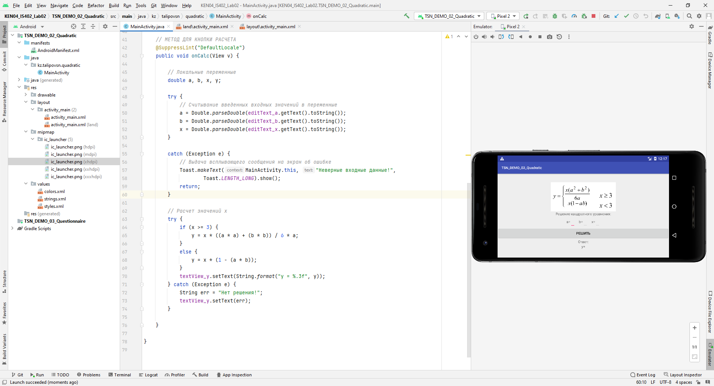

# KENSoft Android Project 2

**Квадратное уравнение с 2-мя разметками:**




```
            if (x >= 3) {
                y = x * ((a * a) + (b * b)) / 6 * a;
            }
            else {
                y = x * (1 - (a * b));
            }
```
